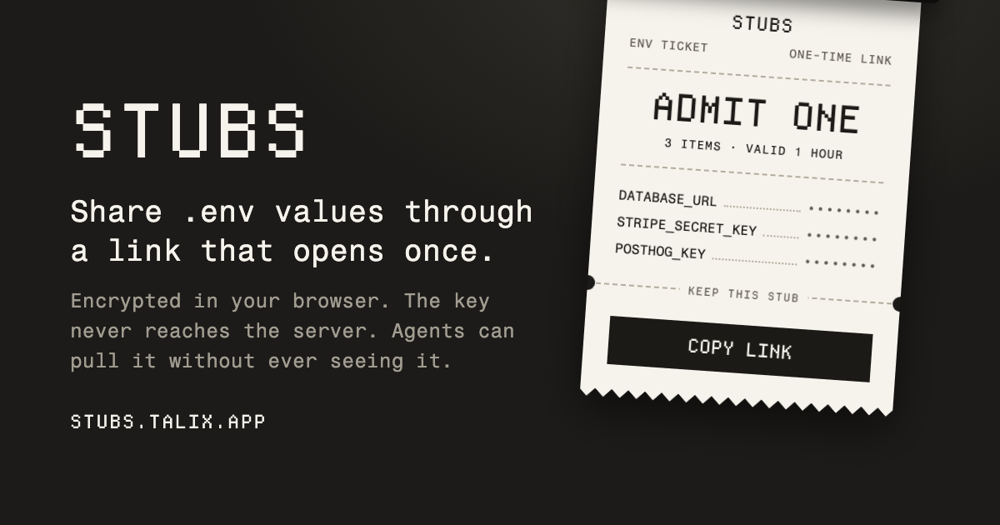

<p align="center"></p>

<p align="center">Share .env values through a link that opens once.</p>

<p align="center">
  <a href="https://stubs.talix.app">Open Stubs</a> ·
  <a href="https://www.npmjs.com/package/@talix/stubs">CLI on npm</a> ·
  <a href="https://stubs.talix.app/security">Security</a>
</p>

Stubs sends `.env` values to another person or an agent. It encrypts them on your
machine and stores the ciphertext until someone opens the ticket or it expires.
The first person to tear the ticket gets the values. The server then deletes its copy.

## Use it in the browser

1. Open [stubs.talix.app](https://stubs.talix.app) and paste your `.env` text.
2. Choose an expiry: 5 minutes, 1 hour, 1 day, or 7 days.
3. Optionally enter a recipient's stubs id in "Lock to a recipient".
4. Print the ticket and send the link to the recipient.

For an unlocked ticket, the recipient opens the link and clicks to tear it.
Opening the page alone only checks its status, so a chat preview won't use it up.
Treat an unlocked link like the values themselves. Anyone with it can open it first.

A locked ticket opens through `stubs pull` on the recipient's machine. The recipient
creates an identity once with `stubs init` and shares the id with the sender.
The link alone can't open, check, or burn that ticket.
See the [CLI commands](cli/README.md#commands) to set this up.

## For agents

Install the skill for Claude Code or Codex:

```bash
npx -y --loglevel=warn -- @talix/stubs@0.5.0 skill install
```

The skill tells the agent how to pull a link, run commands with its values, and share
them again without reading the env file. It works across projects.

- `pull` writes to `.env.local` and prints key names only.
- `run -- <command>` loads the file and masks recognised values in stdout and stderr.
- `push` encrypts the file and prints a new link, without printing the values.

Add `--protect` to install Claude Code rules that deny its file tools access to env
files and the stubs config folder. Codex installs the skill but no equivalent deny rule.
The [CLI README](cli/README.md) covers commands, exit codes, MCP setup for Claude Code,
Cursor, and Codex, and instructions for a project's `AGENTS.md`.

For direct entry without a plaintext file, run `stubs push --prompt` in your own
terminal. Paste the multiline `.env`, then press Ctrl-D. Input is hidden; Ctrl-C cancels.
Give the agent only the resulting link, preferably locked to the recipient.
Hidden input doesn't protect against input recording or an agent observing that terminal.

## How it stays private

- Encryption happens on your machine. The server stores ciphertext and can't decrypt it.
- The key travels in the link's `#` fragment, which browsers don't send to the server.
- Checking or opening a ticket requires proof derived from the link. An id alone can't
  read, check, or burn it.
- A ticket can be claimed once. Concurrent opens can't both succeed. Expiry deletes it too.
- Locked links wrap the key for one recipient's identity. The link alone isn't enough.
- The page clears the key from the address bar and forgets opened or void tickets.
  The site uses a strict content security policy and self-hosted fonts.

There are limits. A lost claim response can leave the recipient without the values
after the ticket is consumed. Unopened links can remain in browser history and session
storage. Cloudflare recovery can retain deleted ciphertext for 30 days.
See the [security model](docs/security-model.md) for crypto details, analytics, and limits.

### What this protects and what it doesn't

The CLI reduces accidental leaks into logs and transcripts. It doesn't stop an agent
that can run arbitrary code as you from reading your files or sending values elsewhere.
`run` masks plain values and supported JSON, URL, and base64 encodings. Values shorter
than 6 characters and unrecognised transformations aren't masked.
See the [full CLI protection limits](docs/cli-reference.md#what-this-protects-and-what-it-doesnt).

## Read more

- [CLI guide](cli/README.md) and [command reference](docs/cli-reference.md)
- [Security model, analytics, and known limits](docs/security-model.md)
- [Development, API, and releases](docs/development.md)
- [Agent tooling specification](docs/agent-tooling.md)
- [Security contact](https://stubs.talix.app/security)
